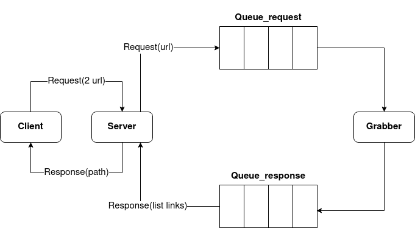

# msgqueue_soa

Видео с работающим приложением: https://youtu.be/cgiIip9XsIY

Данный проект находит путь по ссылкам между двуми старницами wikipedia.


## Тест

Чтобы протестировать приложение :

### Шаг 1

Делаем `git clone` данного репозитория

```
git clone https://github.com/brokensm1le/msgqueue_soa.git
```

### Шаг 2

Запускаем сначала RabbitMQ из докера на порту, например, 15672:

```
docker run -it --rm --name rabbitmq -p 5672:5672 -p 15672:15672 rabbitmq:3.9-management
```

Далее заупскаем в разных консолей `grabber.py`, `server.py` и `client.py`:

```
Terminal1:
python3 grabber.py

Terminal2:
python3 server.py

Terminal3:
python3 client.py
```

## Дизайн


